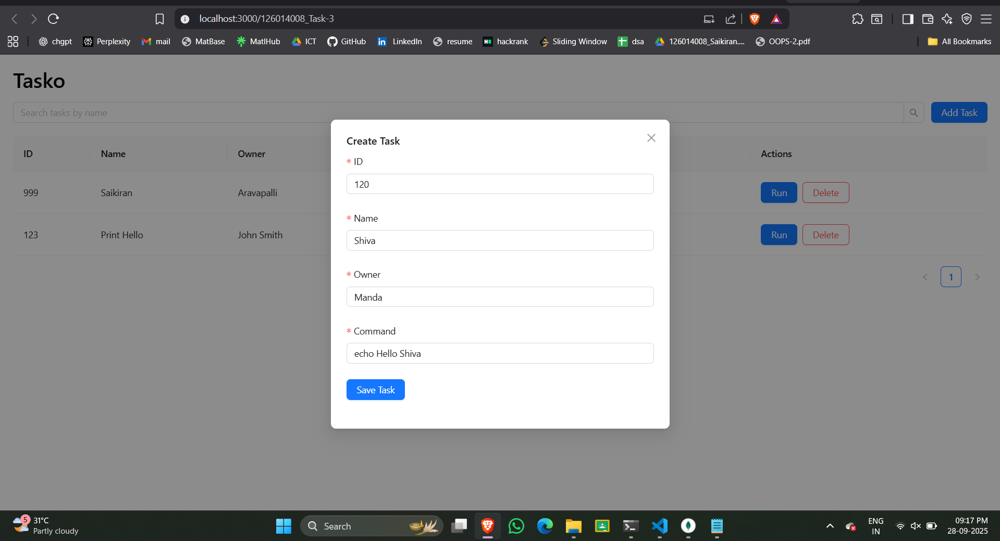
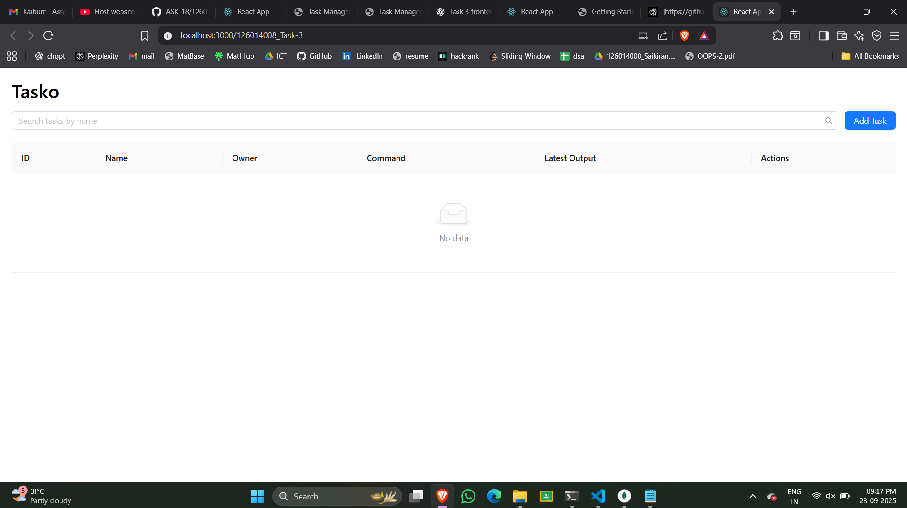
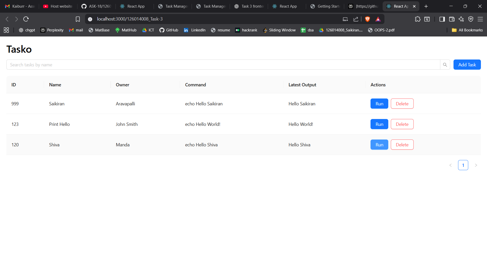
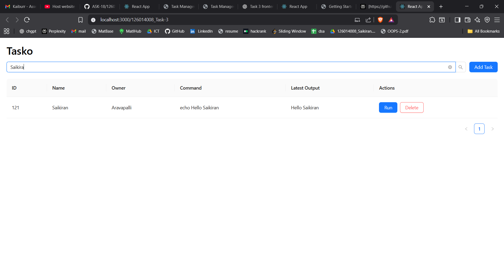
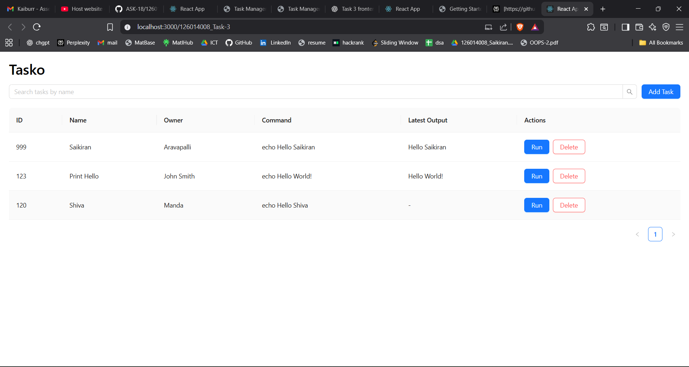
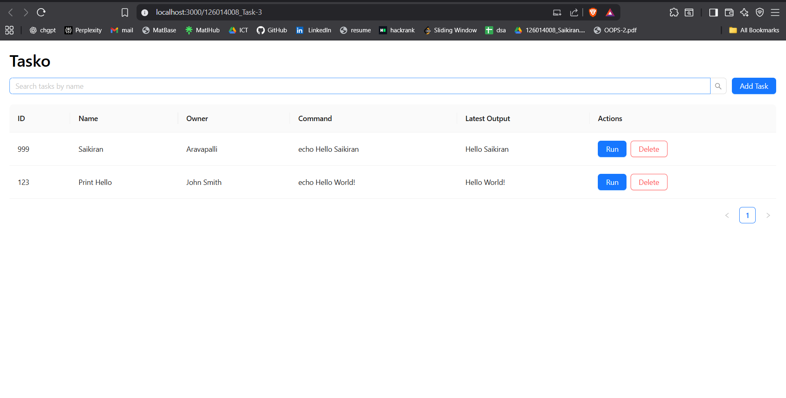
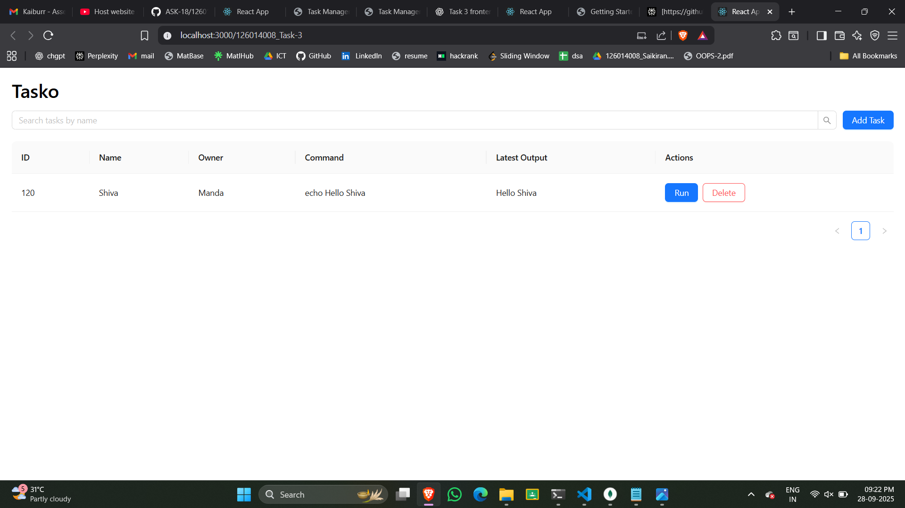

# Task Manager UI
**Live Website:** [https://ask-18.github.io/126014008_Task-3/](https://ask-18.github.io/126014008_Task-3/)
- A **React + TypeScript + Ant Design** frontend for managing and executing tasks using a Java backend REST API. Users can create, view, search, delete tasks, run commands, and view outputs in a user-friendly interface.

---
## Screen Recording
- Screen Recoding:[https://drive.google.com/file/d/1SQymaxDyjxXgjepbuE-OdTwbOk4ft_au/view?usp=sharing](https://drive.google.com/file/d/1SQymaxDyjxXgjepbuE-OdTwbOk4ft_au/view?usp=sharing)
---

## Table of Contents
- [Features](#features)  
- [Installation & Setup](#installation--setup)  
- [Usage](#usage)  
- [Tech Stack](#tech-stack)  
- [Screenshots](#screenshots)  
- [Contributing](#contributing)  
- [License](#license)  

---

## Features
- Create new tasks with `name`, `owner`, and `command`.  
- View all tasks in a searchable and sortable table.  
- Delete tasks easily.  
- Execute tasks and view command output.  
- Responsive and user-friendly UI using Ant Design components.  
- Supports integration with Java REST API backend.  

---

## Installation & Setup

1. Clone the repository:

```bash
git clone https://github.com/ASK-18/126014008_Task-3.git
cd 126014008_Task-3
```
2. Install dependencies:
```
npm install
```

3. Run in development mode:
```
npm start
```

**Open http://localhost:3000 to view in your browser.**

4. Build for production:
```
npm run build
```

**The production-ready files will be in the build/ folder, ready to deploy.**

## Usage

### Navigate through the UI to:

- Create tasks by providing name, owner, and command.

- View tasks in the table and filter/search by name.

- Delete tasks that are no longer needed.

- Execute tasks and monitor their output.

**Note: Task execution requires a running Java backend REST API connected to MongoDB.**

## Tech Stack

 - Frontend: React 19, TypeScript, Ant Design

 - Backend: Java REST API (MongoDB integration)

 - Deployment: GitHub Pages (static frontend)

 - State Management: React useState and useEffect

## Screenshots

## Screenshots
### Task Manager Screenshots

<!-- CREATE -->
#### CREATE
*Insert a new task successfully.*  
  

<!-- READ -->
#### READ
*Initial view of the app.*  
  

*Display all tasks in the table.*  
  

*Search tasks by a keyword.*  
  

<!-- UPDATE -->
#### UPDATE
*Task before execution (can be updated).*  
  

<!-- EXECUTE -->
#### EXECUTE
*Execute a task command.*  
  

<!-- DELETE -->
#### DELETE
*Delete an existing task.*  
  


## Contributing

### Contributions are welcome!

1. Fork the repository.

2. Create a new branch: git checkout -b feature-name
3. Make your changes and commit: git commit -m "Add feature"

4. Push to the branch: git push origin feature-name

5. Open a Pull Request.

## License

**© 2025 Kaiburr LLC. All rights reserved.**
